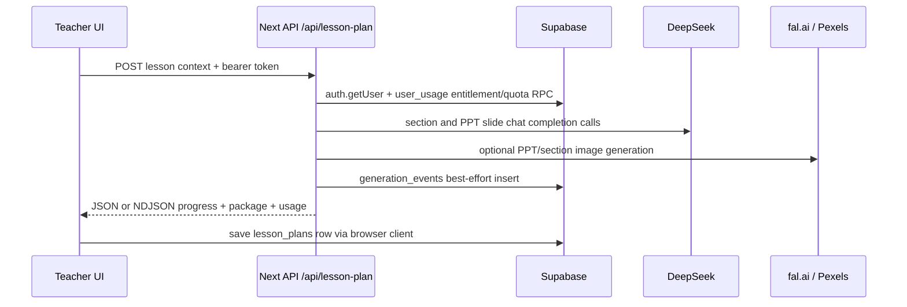

# Data Flow

## Lesson Plan Generation



Evidence: `src/components/lesson-plan/lesson-plan-generator.tsx`, `src/app/api/lesson-plan/route.ts`, `src/lib/user-usage-server.ts`.

## Question Paper Flow

Teacher UI posts form to `/api/question-paper`; API authenticates, verifies Pro entitlement, reserves one generation, calls DeepSeek through `callDeepSeekChat`, parses sections, logs `generation_events`, best-effort inserts `question_paper_generations`, then returns paper/answer/marking content. If selected, the client performs a second call to `/api/question-paper/blueprint`.

Evidence: `src/components/question-paper/question-paper-generator.tsx`, `src/app/api/question-paper/route.ts`.

## Differentiated Pack Flow

The client loops over `foundation`, `core`, and `extension`, posting once per level to `/api/differentiated-pack`. The endpoint authenticates and plan-checks each call, sends a DeepSeek request for the level, parses marker-delimited output, logs a non-metered generation event, and best-effort persists to `differentiated_pack_generations`.

Evidence: `src/components/differentiated-pack/differentiated-worksheet-pack.tsx`, `src/app/api/differentiated-pack/route.ts`.

## Billing Flow

```mermaid
flowchart TD
  UI[Pricing/PaymentModal/Settings] --> API[Razorpay Next APIs]
  API --> RP[Razorpay API]
  API --> DB[(Supabase orders/subscriptions/user_usage)]
  RP --> WH[/api/razorpay/webhook]
  WH --> DB
  CRON[Vercel daily cron] --> MAINT[/api/cron/subscription-maintenance]
  MAINT --> DB
  MAINT --> SMTP[SMTP notices]
```

Evidence: `src/lib/razorpay.ts`, `src/app/api/razorpay/**/route.ts`, `vercel.json`, `src/lib/subscription-billing.ts`.

## Admin Flow

Admin pages are server-gated by Supabase user identity and `admin_roles`; client tabs then call `/api/super-admin/**`. Privileged API handlers use service-role Supabase only after checking `isAdminUser`, `isSuperAdmin`, or `hasPermission`.

Evidence: `src/app/super-admin/page.tsx`, `src/components/admin/super-admin-dashboard.tsx`, `src/lib/super-admin.ts`.
