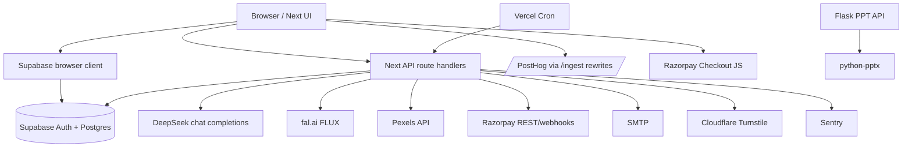
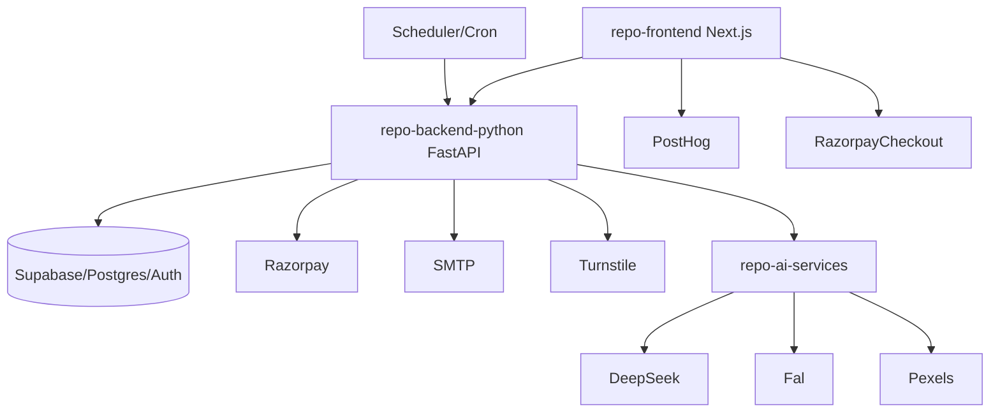

# Dependency Graph

## Current Graph

## Target Graph

## Cross-component Dependencies

- Frontend directly depends on Supabase client and tables for auth/session/saved lessons.
- Frontend depends on exact Next API JSON/NDJSON shapes.
- Next APIs depend on `src/lib` modules that mix frontend-safe constants and server-only secrets.
- AI generation depends on backend quota and billing plan state.
- Billing depends on user usage updates and admin audit logging.
- Admin dashboards depend on Supabase Auth user list through service role.

Circular/coupled areas:

- `lesson-plan` generation returns content that the client writes directly to Supabase, while admin moderation reads the same table through backend APIs.
- Plan constants are used by UI and backend security checks.
- AI generation and usage metering are in the same request transaction without a durable job boundary.
